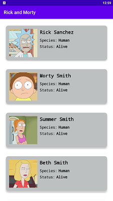

# Rick_N_Morty

This project is a demostration of the use of __retrofit__, __moshi__, __coil__, __viewModel__ to fetch and display data from an __API__.
The api used for this project is __https://rickandmortyapi.com/__ and the __@GET__ request was made to __api/character__. 
The modelof this project fetches the Rick and Morty character image, name, species and status. See picture description below.

## Description

